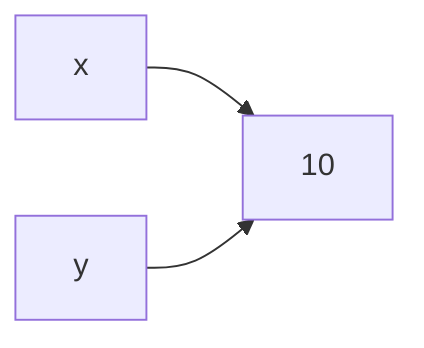
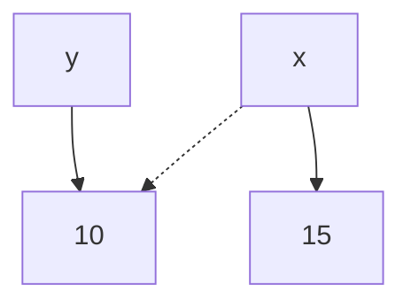

<div class="alert-info text-sm">
In the next four lessons, we will explore some important concepts in Python: variable assignment, variable reference, and things to watch out for when working with functions. We'll learn how variables store values and how they connect to objects in memory. Understanding variable reference is essential to understand how mutable objects behave and to avoid unexpected issues in our code. 
</div>

### Variable assignment with immutable objects

When a variable is assigned a value in Python, the variable does not store the value itself. Instead, Python creates a reference pointing to the value in the memory.

When we create variables `x` and `y` and give them the value `10`, we create a reference that points to the value `10` in the memory. We could check this by using the function `id()` to check their positions in the memory, and we will see that they are the same.

```python
x = 10
y = x
print(id(x)) # 140314708984336
print(id(y)) # 140314708984336
```



In the case of **immutable objects**, such as **string**s, **int**s, and **float**s, when we reassign a new value to the variable `x`, Python creates a new value in the memory and updates the reference without affecting the value of `y`.

```python
x = 10
print(id(x)) # 140314708984336
y = x
print(id(y)) # 140314708984336
x = 15
print(id(y)) # 140634520519344
print(x) # 15
print(y) # 10
```



---

### Exercise

Take a look at the code below:

```python
x = "Hello World"
y = x
x = "Python is awesome!"
```

1. What is the value of `x`?
1. What is the value of `y`?

Create a variable `x` and `y` in the editor and assign their values with the answers, then run the program.

#### Tests

<ul>
<li id="test-1">What is the value of <code>x</code>?</li>
<li id="test-2">What is the value of <code>y</code>?</li>
</ul>
