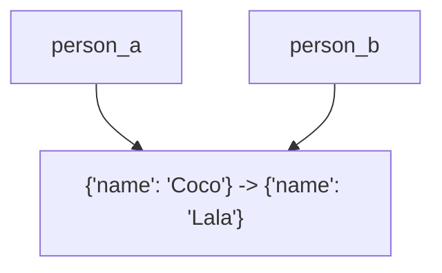

### Variable assignment with mutable objects

Mutable objects in Python, such as **dict**s and **list**s, are passed by reference, meaning that **if we assign a mutable object to multiple variables**, they all point to the same memory location. Modifying the object through one variable will affect all the other variables referencing the same object.

For example:

```python
person_a = {"name": "Coco"}
person_b = person_a # <-- Assign with existing dictionary
person_b["name"] = "Lala"
print(person_a) # {'name': 'Lala'}
print(person_b) # {'name': 'Lala'}
```



<p class="caption">
When we change the object in place, Python does not create a new object.
</p>

In this example, we modified the dict's `name` value, which affected both `person_a` and `person_b`. This is because they both point to the same object in the memory. The same happens for **list**s as well.

```python
list_a = [1, 2, 3]
list_b = list_a # <-- Assign with existing list
list_a.append(4)
print(list_a) # [1, 2, 3, 4]
print(list_b) # [1, 2, 3, 4]
```

---

### Exercise

Take a look at the code below:

```python
animal_a = {"type": "Dog"}
animal_b = animal_a
animal_a["name"] = "Fluffy"
```

1. What is the value of `animal_a`?
1. What is the value of `animal_b`?

#### Tests

<ul>
<li id="test-1">What is the value of <code>animal_a</code>?</li>
<li id="test-2">What is the value of <code>animal_b</code>?</li>
</ul>
