### Mutable objects as function arguments

Mutable objects passed as function arguments can be modified within the function. If we pass a mutable object to a function and that function modifies the object, it can have unintended consequences outside the function scope.

For example:

```python
def add_value(dict_to_add, key, value):
    print(id(dict_to_add)) # 139776005167360
    dict_to_add[key] = value
    return dict_to_add

person = {"name": "James"}
print(id(person)) # 139776005167360
new_person = add_value(person, "age", 200)
print(person) # {'name': 'James', 'age': 200}
print(new_person)# {'name': 'James', 'age': 200}
```

In the example above, we could see that both `person` and `new_person` was changed, even though we didn't want to change the value of `person`. This is because when `person` is passed to `add_value()` function, the variable `dict_to_add` points to the same object as `person` does. We could see in lines 2 and 7 that they share the same id.

<div class="alert-info text-sm">
When a function changes something outside of its scope, it causes <b>side effects</b>, which leads to unintended results and make the program more difficult to debug.
</div>

### Best practice to follow

When working with mutable objects, such as **dict**s and **list**s, try to avoid modifying them in place whenever possible. Instead, create a new object by calling the method `dict.copy()` or `list.copy()`, then modify the new object instead. For example:

```python
def add_value(dict_to_add, key, value):
    dict_to_update = dict_to_add.copy() # <-- Create a copy object
    dict_to_update[key] = value
    return dict_to_update

person = {"name": "James"}
new_person = add_value(person, "age", 200)
print(person) # {'name': 'James'}
print(new_person) # {'name': 'James', 'age': 200}
```



```mermaid
flowchart
    A[dict_to_add] --> Z["{'name': 'James'}"]
    A -. "dict_to_add.copy()" .-> Y["{'name': 'James'}\n &#8595;\n{'name': 'James', 'age': 200}"]
    B[dict_to_update] --> Y
```

In the example above, instead of modifying the `dict_to_add` directly, we make a new copy and assign it to the variable `dict_to_update`. Now `dict_to_add` and `dict_to_update` are two different objects, and the function `add_value()` no longer causes **side-effects**.

---

### Exercise

Update the body of the function `add_to_list()` so that it does not modify the list outside its scope.

#### Tests

We have created a variable `my_list` to be `[1, 2, 3]`.

<ul>
<li id="test-1"><code>add_to_list(my_list, 4)</code> should return <code>[1, 2, 3, 4]</code></li>
<li id="test-2"><code>add_to_list(my_list, 4)</code> should not modify the value of <code>my_list</code></li>
</ul>
