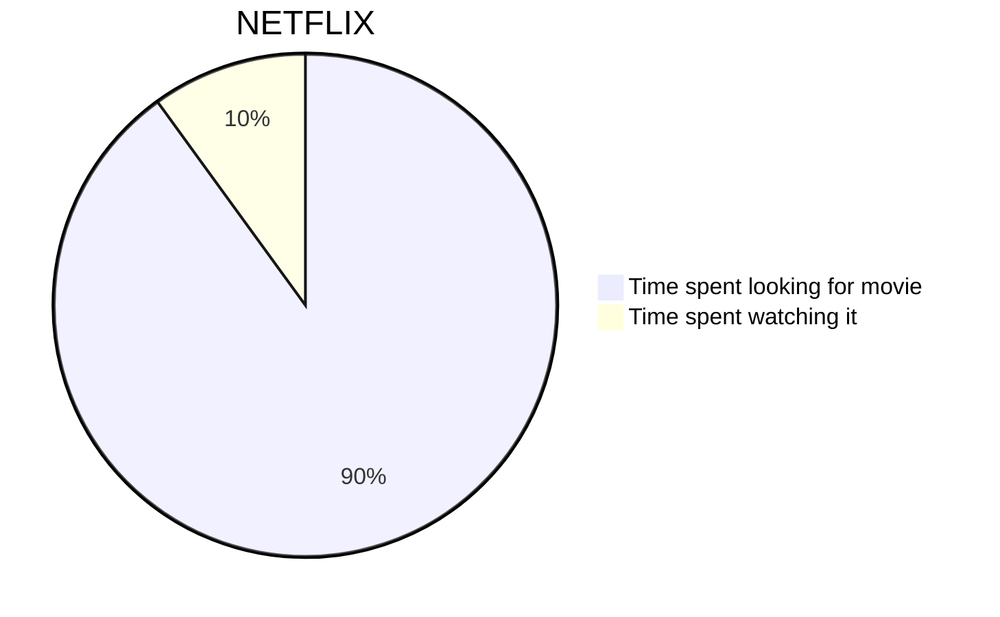
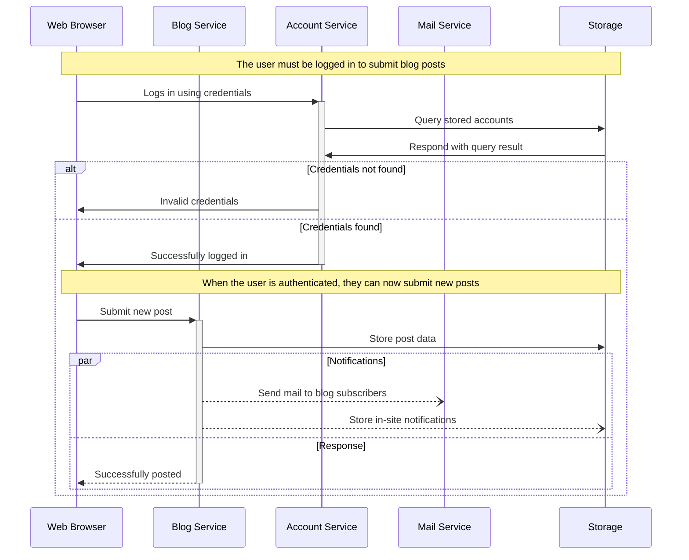

# Keys

++ctrl+alt+delete++

# Emoji

:smile: :heart: :thumbsup:

# Details

/// details | Some summary
attrs: {class: border border-red-500 px-3 cursor-pointer mb-4}
type: warning

Some content
///

#### Opening as default

/// details | Some summary
attrs: {class: border border-red-500 px-3 cursor-pointer mb-4}
open: True
type: warning

Something
///

# Alerts

<div class="alert-info">
This is the content

```python
print("OKAY")
```

</div>

<div class="alert-warning">
This is the content

```python
print("OKAY")
```

</div>

<div class="alert-danger">
This is the content

```python
print("OKAY")
```

</div>

# Code blocks {.mt-4}

Paragraph.

```
a fenced block
```

Another paragraph.

> ```
>   a fenced block
> ```

> with blank lines

```
### Code blocks inside list

- &#32;
```

a fenced block

```

Definition
: &#32;
```

a fenced block

```


```

============================================================
T Tp Sp D Dp S D7 T

---

A F#m Bm E C#m D E7 A
A# Gm Cm F Dm D# F7 A#
B♭ Gm Cm F Dm E♭m F7 B♭

````

# Mermaid




````
